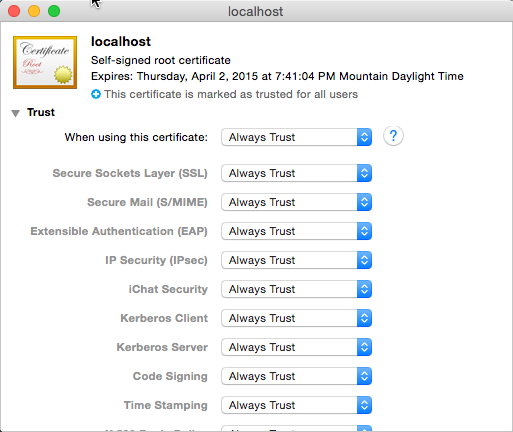
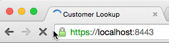

# Configure Express with SSL Certificate for HTTPS Development on OS X
Local web development using HTTP is very common and easy to do on OS X with tools like [express](http://npmjs.org/package/express) & [superstatic](http://npmjs.org/package/superstatic). However when you want to do local HTTPS development for secure endpoints there is a bit more work involved. This simple script uses node.js & express to host a local web server that listens only on HTTPS:

  ````javascript
  'use strict';
  
  var fs = require('fs'),
      express = require('express'),
      https = require('https');
  
  var https_options = {
    key: fs.readFileSync('./ssl-key.pem'),
    cert: fs.readFileSync('./ssl-cert.pem')
  };
  
  var PORT = 8443,
      HOST = 'localhost';
  
  var app = express();
  
  // setup express to have static resource folders
  app.use('/', express.static(__dirname + '/../public'));
  
  var server = https.createServer(https_options, app)
                    .listen(PORT, HOST);
  
  console.log('+-+-+-+-+-+-+-+-+-+-+-+-+-+-+-+-+-+-+-+-+-+-+-+-+-+');
  console.log('HTTPS Server listening @ https://%s:%s', HOST, PORT);
  console.log('+-+-+-+-+-+-+-+-+-+-+-+-+-+-+-+-+-+-+-+-+-+-+-+-+-+');
  ````

> The above script is created by this Yeoman generator (**nodehttps**) however it references the public key and private certificate for an SSL certificate. You need to obtain a certificate and ensure your development system trusts this certificate.  

For this to work, you need to either obtain a certificate and key from a **Trusted Root Authority** (such as Verisign, GoDaddy, your corporate certificate authority or another provider), or you must create a self-signed certificate. The latter is common in development environments but involves manual steps in creating it.

If you generate a self-signed certification, your browser will report that the certificate is not trusted and thus some applications that validate the certificate will reject the requests:


To fix this you must configure the certificate as a Trusted Root Authority on your development environment. If you use a certificate obtained from a Trusted Root Authority, this is not required.

## Create a Self Signed Certificate
In this step you will create a self-signed certificate, certificate request & public key using the tool **[OpenSSL](https://www.openssl.org/)**.

> *Note: If you already have a SSL public key & private certificate from a Trusted Root Authority, you can jump to the step [Update server.js with SSL Key & Certificate](setup-https.md#update-serverjs-with-ssl-key-and-certificate).*

1. Open a **Terminal** prompt and enter the following command:

  ````
  $ openssl genrsa -out ssl-key.pem 1024 
  ````

1. Next, create the certificate request:

  ````
  $ openssl req -new -key ssl-key.pem -out ssl.csr
  ````

  At this stage the **openssl** tool will prompt you for a few more items. These values will get added to the certificate request that you are generating to get the private key. What follows is an example of some options you can use. The important point is to use **localhost** for the **Common Name** request.

  ````
  Country Name (2 letter code) [AU]:US
  State or Province Name (full name) [Some-State]:Washington
  Locality Name (eg, city) []:Redmond
  Organization Name (eg, company) [Internet Widgits Pty Ltd]:Contoso
  Organizational Unit Name (eg, section) []:corp
  Common Name (e.g. server FQDN or YOUR name) []:localhost
  Email Address []:admin@contoso.com

  Please enter the following 'extra' attributes
  to be sent with your certificate request
  A challenge password []:
  An optional company name []:
  ````

1. Now create the certificate from the certificate request:

  ````
  $ openssl x509 -req -in ssl.csr -signkey ssl-key.pem -out ssl-cert.pem
  ````

At this point you have the public-private key pair for the certificate.

You can use these in the files in the script at the top of these instructions. However you will notice that, as stated previous, the browser won't respect the certificate. You will see a **Your connection is not private** message in Chrome and the URL will show an error with the certificate:

  

To fix this, you need to add the certificate as a trusted root authority.

## Add Self-Signed Certificate as Trusted Root Authority
In this step you will add the self-signed certificate to your local machine as a Trusted Root Authority. These steps assume you are running OS X Yosemite v10.10.4.

> *Note: If you already have a SSL public key & private certificate from a Trusted Root Authority, you can jump to the step [Update server.js with SSL Key & Certificate](setup-https.md#update-serverjs-with-ssl-key-and-certificate).*

1. Within Chrome, do the following:

  1. In the address bar, click the little lock with the X. This will bring up a small information screen. Click the button that says "Certificate Information."
  1. Click and drag the image to your desktop. It looks like a little certificate.

    

1. Open the **Keychain Access** utility in OS X.
  1. Select the **System** option on the left.
  1. Click the lock icon in the upper-left corner to enable changes.

    

  1. Click the plus button at the bottom and select the **localhost.cer** file you copied to the desktop.
  1. In the dialog that comes up, click **Always Trust**.
  1. After **localhost** gets added to the **System** keychain, double-click it to open it again.
  1. Expand the **Trust** section and for the first option, pick **Always Trust**.

    

At this point everything has been configured. At this point you now have a self-signed certificate trusted on your development system.

## Update server.js with SSL Key and Certificate
Once you have the certificates, either self-singed certificate or one you obtained from a Trusted Root Authority, you need to add them to the site & update the `server.js` file with their locations.

1. Place the two files in the `/src/` folder of the site.
1. Locate the following code in `server.js`:

  ````javascript
  var https_options = {
    key: fs.readFileSync(__dirname +'/../ssl-key.pem'),
    cert: fs.readFileSync(__dirname +'/../ssl-cert.pem')
  };
  ````

1. Update the names of the two files.
  - They first one (key) should be the public key certificate.
  - The second one (cert) is the private certificate.

You should now be able to run the Express webserver using the specified HTTPS port by running the following from the `src` folder:

````bash
node server/server.js
````

Quick all browsers and navigate to the local HTTPS site. The browser should report it as a valid certificate:

